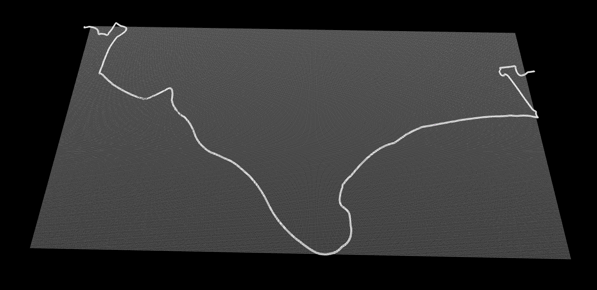

# gpx2xodr

**gpx2xodr** is a Python tool to convert a GPX ([GPS Exchange Format](https://wiki.openstreetmap.org/wiki/GPX)) track into a XODR ([OpenDrive](https://www.asam.net/standards/detail/opendrive/)) file.

## Installation

Use the package manager [pip](https://pip.pypa.io/en/stable/) to install the required packages.

```bash
pip install -r requirements.txt
```

## Usage

Use the `convert.py` script to convert a `.gpx` file. The file `example.gpx` is provided for quickstart.

```bash
python convert.py -i <input path> -o <output path>
```

Check out the viewer at [odrviewer.io](https://odrviewer.io/) to visualize the created road.


